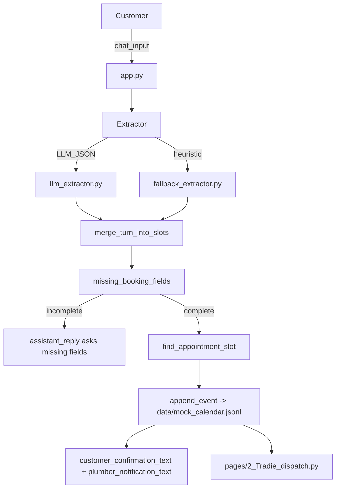

## Project: AI plumbing booking assistant — workflow summary (for report)

### Public GitHub repository
- `https://github.com/MathgeniusTB2/AI-plumbing-booking-assistant`

### High-level workflow (code execution path)



### Code workflow details (what each module does)

#### 1) Customer chat UI and orchestration
- Entry point: [`app.py`](app.py)
- Maintains Streamlit session state:
  - `slots` (accumulated booking information)
  - `messages` (chat transcript)
  - `conversation_phase` (`collecting` → `booked`)
- Per user message:
  - Runs extraction (LLM or fallback)
  - Merges extracted fields into `slots`
  - If required fields are missing, uses `assistant_reply` to ask only for missing info
  - If complete, schedules an appointment and shows confirmation + mock notification drafts

#### 2) Slot schema and completeness rules
- Schema: [`booking_assistant/schemas.py`](booking_assistant/schemas.py)
  - `ExtractionTurn` (Pydantic): `intent`, `issue_category`, `urgency`, `location`, `preferred_time_notes`, `customer_name`, `customer_phone`, `customer_email`, and `assistant_reply`.
- Completeness:
  - Required slots: `issue_category`, `urgency`, `location`, `customer_name`
  - Contact rule: at least one of `customer_phone` or `customer_email` must be present

#### 3) Algorithm A — Local LLM extractor (OpenAI-compatible)
- Module: [`booking_assistant/llm_extractor.py`](booking_assistant/llm_extractor.py)
- Purpose: produce a *single JSON object* matching `ExtractionTurn`.
- Steps:
  - Check reachability of local server at `LOCAL_LLM_BASE_URL` by calling `/v1/models`.
  - Call `chat.completions.create` against the local server using:
    - default model: `qwen2.5:3b-instruct`
    - `response_format={"type":"json_object"}` (when supported)
  - Parse/validate JSON with Pydantic.
  - If JSON parse/validation fails, do a second “repair” call with a stricter JSON-only system prompt.

#### 4) Algorithm B — Heuristic fallback extractor (no model required)
- Module: [`booking_assistant/fallback_extractor.py`](booking_assistant/fallback_extractor.py)
- Purpose: extract approximate slot values using regex/keywords when `USE_LLM=0` or the local server is down.
- Methods:
  - Issue category: keyword matching (e.g. “tap”, “leak”, “blocked drain” → normalized labels)
  - Urgency: keyword matching (“urgent/asap/emergency/today”)
  - Contact: regex for phone/email
  - Location: regex patterns for address-like phrases
  - Name: simple regex (may be imperfect; see empirical note below)
- Produces `assistant_reply` that asks only for missing fields.

#### 5) Scheduling + persistence (mock calendar)
- Scheduler module: [`booking_assistant/scheduler.py`](booking_assistant/scheduler.py)
- Roster + availability: [`data/plumbers.json`](data/plumbers.json)
- Calendar persistence: [`booking_assistant/mock_calendar.py`](booking_assistant/mock_calendar.py) → `data/mock_calendar.jsonl`
- Scheduling logic:
  - Filter plumbers by skill match (`plumber_matches_issue`).
  - For each day in a horizon (default 21 days), iterate availability windows for each plumber.
  - Step through candidate start times at `step_minutes` increments (default 30).
  - Reject any interval that overlaps an existing job read from the calendar JSONL.
  - On first feasible slot, append a JSON record to `data/mock_calendar.jsonl` and return a `ScheduledAppointment`.

#### 6) Tradie dispatch board
- Page: [`pages/2_Tradie_dispatch.py`](pages/2_Tradie_dispatch.py)
- Reads `data/mock_calendar.jsonl`, filters by plumber/upcoming/search, displays a summary table + per-job dispatch text, and allows export of filtered jobs as JSON.

---

## Pre-processing workflow (external dataset for experiments)

### Dataset
- Hugging Face dataset: `google-research-datasets/schema_guided_dstc8` (DSTC8 Schema-Guided Dialogue)

### Preprocessing script
- Script: [`booking_assistant/schema_guided_preprocess.py`](booking_assistant/schema_guided_preprocess.py)
- What it does:
  - Streams the dataset split (`train`/`validation`/`test`) to avoid loading everything into memory.
  - Converts each dialogue into:
    - **Dialogues JSONL**: `sgd.<split>.dialogues.jsonl` (speaker-tagged turns)
    - **User-turns JSONL**: `sgd.<split>.turns.jsonl` (one row per user turn with `active_intent`, `filled_slots`, and `dialogue_prefix`)
  - Normalizes nested slot values (e.g. `[['San Jose']]` → `"San Jose"`)

---

## Empirical analysis (small-sample, Colab-friendly)

### A) SGD preprocessing results (sample fraction)
Command run (small sample):

```bash
python -m booking_assistant.schema_guided_preprocess --split train --max-dialogues 200
```

Raw run output:

```text
Wrote 200 dialogues -> /home/james/Documents/Code/NLP/data/processed/sgd.train.dialogues.jsonl
Wrote 1924 user-turn rows -> /home/james/Documents/Code/NLP/data/processed/sgd.train.turns.jsonl
Source: google-research-datasets/schema_guided_dstc8 split='train' max_dialogues=200
```

Observed output counts:
- Dialogues written: **200**
- User-turn rows written: **1924**
- Output files:
  - `data/processed/sgd.train.dialogues.jsonl`
  - `data/processed/sgd.train.turns.jsonl`

Example rows from `sgd.train.turns.jsonl` (first 2 lines):

```json
[
  {
    "dialogue_id": "1_00000",
    "services": ["Restaurants_1"],
    "turn_idx": 0,
    "user_utterance": "I am feeling hungry so I would like to find a place to eat.",
    "system_utterance": "Do you have a specific which you want the eating place to be located at?",
    "active_intent": "FindRestaurants",
    "filled_slots": {},
    "dialogue_prefix": []
  },
  {
    "dialogue_id": "1_00000",
    "services": ["Restaurants_1"],
    "turn_idx": 2,
    "user_utterance": "I would like for it to be in San Jose.",
    "system_utterance": "Is there a specific cuisine type you enjoy, such as Mexican, Italian or something else?",
    "active_intent": "FindRestaurants",
    "filled_slots": {"city": "San Jose"},
    "dialogue_prefix": [
      ["user", "I am feeling hungry so I would like to find a place to eat."],
      ["system", "Do you have a specific which you want the eating place to be located at?"]
    ]
  }
]
```

### B) Booking workflow results (synthetic sample chats)
We ran a synthetic conversation using the **heuristic fallback extractor** (so it runs without Ollama).

Inputs (4 user turns):
1) “Hi, my kitchen tap is leaking and it’s getting worse.”
2) “It’s pretty urgent — can someone come today?”
3) “I’m at 12 King Street, Newtown.”
4) “My name is Alex Chen. You can reach me on alex.chen@example.com”

Raw run output (captured from a script that calls `extraction_turn_fallback` → `merge_turn_into_slots` → `find_appointment_slot`):

```json
{
  "turns": [
    {
      "user": "Hi, my kitchen tap is leaking and it’s getting worse.",
      "assistant_reply": "Thanks for the details. Could you also share: urgency, location, customer name, a phone number or email?",
      "partial_slots": {
        "issue_category": "tap"
      }
    },
    {
      "user": "It’s pretty urgent — can someone come today?",
      "assistant_reply": "Thanks for the details. Could you also share: location, customer name, a phone number or email?",
      "partial_slots": {
        "issue_category": "tap",
        "urgency": "emergency"
      }
    },
    {
      "user": "I’m at 12 King Street, Newtown.",
      "assistant_reply": "Thanks for the details. Could you also share: a phone number or email?",
      "partial_slots": {
        "issue_category": "tap",
        "urgency": "emergency",
        "location": "12 King Street",
        "customer_name": "at"
      }
    },
    {
      "user": "My name is Alex Chen. You can reach me on alex.chen@example.com",
      "assistant_reply": "Thanks — I have what we need. I’ll check the next available licensed plumber and confirm the appointment.",
      "partial_slots": {
        "issue_category": "tap",
        "urgency": "emergency",
        "location": "12 King Street",
        "customer_name": "Alex Chen",
        "customer_email": "alex.chen@example.com"
      }
    }
  ],
  "final_slots": {
    "issue_category": "tap",
    "urgency": "emergency",
    "location": "12 King Street",
    "customer_name": "Alex Chen",
    "customer_email": "alex.chen@example.com"
  },
  "appointment": {
    "plumber_name": "Alex Rivers",
    "start": "2026-05-12T08:00+10:00",
    "end": "2026-05-12T10:00+10:00",
    "issue_summary": "tap (emergency)",
    "location": "12 King Street"
  },
  "calendar_jsonl": {
    "path": "/home/james/Documents/Code/NLP/data/mock_calendar.jsonl",
    "rows_before": 2,
    "rows_after": 3,
    "appended_row_excerpt": {
      "plumber_id": "plumber-alex",
      "plumber_name": "Alex Rivers",
      "start": "2026-05-12T08:00:00+10:00",
      "end": "2026-05-12T10:00:00+10:00",
      "issue_category": "tap",
      "urgency": "emergency",
      "location": "12 King Street",
      "customer_name": "Alex Chen",
      "customer_email": "alex.chen@example.com",
      "preferred_time_notes": null
    }
  }
}
```

Final extracted slots (after merging across turns):

```json
{
  "issue_category": "tap",
  "urgency": "emergency",
  "location": "12 King Street",
  "customer_name": "Alex Chen",
  "customer_email": "alex.chen@example.com"
}
```

Scheduling result (first available slot based on `data/plumbers.json` and calendar conflicts):
- Plumber: **Alex Rivers** (`plumber-alex`)
- Appointment: **2026-05-12 08:00–10:00** (local tz)
- Issue summary: `tap (emergency)`

Calendar persistence check (append-only JSONL):
- File: `data/mock_calendar.jsonl`
- Rows before: **2**
- Rows after: **3**
- Appended row excerpt:

```json
{
  "plumber_id": "plumber-alex",
  "plumber_name": "Alex Rivers",
  "start": "2026-05-12T08:00:00+10:00",
  "end": "2026-05-12T10:00:00+10:00",
  "issue_category": "tap",
  "urgency": "emergency",
  "location": "12 King Street",
  "customer_name": "Alex Chen",
  "customer_email": "alex.chen@example.com",
  "preferred_time_notes": null
}
```

Empirical note (heuristic limitation observed):
- In turn 3 (“I’m at 12 King Street, Newtown.”), the heuristic name regex briefly mis-set `customer_name` to `"at"`; it was corrected on the next turn when the user provided an explicit name. This illustrates why the LLM JSON extractor is preferred when available.

---

### C) Quantitative evaluation (synthetic, labelled; fallback extractor)
To make the “sample results” section reproducible and more rubric-aligned, we evaluated the **heuristic fallback extractor** on a small labelled set of synthetic booking dialogues.

Dataset:
- File: `data/eval/synthetic_booking_eval.jsonl`
- Cases: **20** multi-turn booking conversations

Command:

```bash
python -m booking_assistant.eval_synthetic --try-schedule
```

Metrics (fallback extractor, micro over gold slot key/value pairs):
- Dialogue success rate (booking info complete): **0.85** (17/20)
- Turns-to-complete (successful dialogues): mean **3.88**, median **4**
- Slot micro precision / recall / F1: **0.939 / 0.903 / 0.921**
- Scheduling success rate (given complete booking info): **1.00** (17/17)

Per-slot accuracy (exact match on gold-required fields):
- `issue_category`: **0.95**
- `urgency`: **0.75**
- `location`: **0.95**
- `customer_name`: **0.95**
- `customer_phone`: **0.875**
- `customer_email`: **1.00**
- `preferred_time_notes`: **0.667**

Short error analysis (what failed and why):
- **Urgency under-specified**: when users say “not urgent” or “pretty urgent” the heuristic sometimes maps to a coarse level (or misses it entirely), lowering urgency accuracy.
- **Preferred time detection is keyword-based**: it only triggers on a small list (e.g., “tomorrow”, “morning”, “afternoon”, “tonight”), so phrasing outside that list is missed.
- **Non-address locations**: locations like a suburb-only (“I’m at Newtown.”) rely on a secondary `at <place>` pattern; other free-form location phrases can be missed without the LLM JSON extractor.

